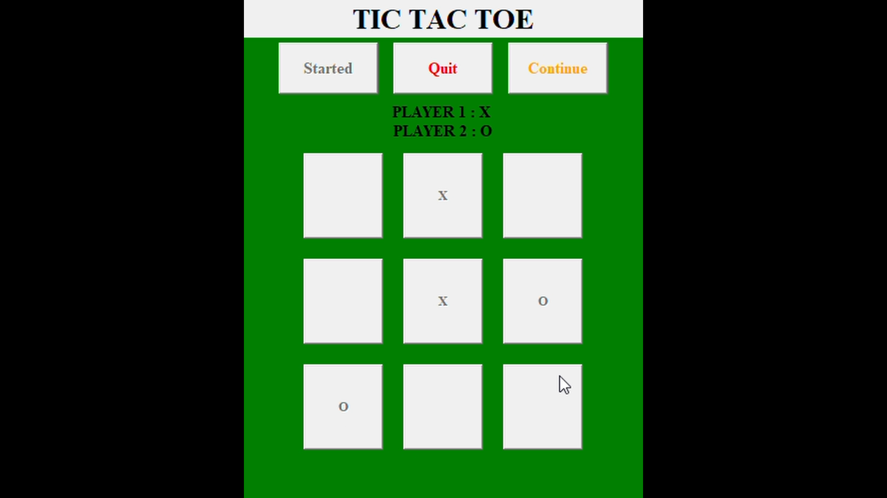

# TicTacToe

Classic Tic-Tac-Toe game made with Tkinter GUI library in Python.
## Features

- Initial player chooses the symbol [X | O]
- Pause button to freeze the game
- Quite button to exit
- Draw/Win message pop-up


## Dependencies

- tkinter

## Deployment

To deploy this project download this folder and run 

```bash
  tictac2.py   // First install all neccessary dependencies listed above.
```


## Screenshots




## Demo

Demo Video:

https://drive.google.com/file/d/1SwNEs6LwC-spqoENgKm6n209HAUPQzdZ/view?usp=sharing
## Lessons Learned

Learned how to work with dynamic elements in GUI application.
## Authors

- [@DhruvDholakia](https://www.github.com/DhruvDholakiaCE)

